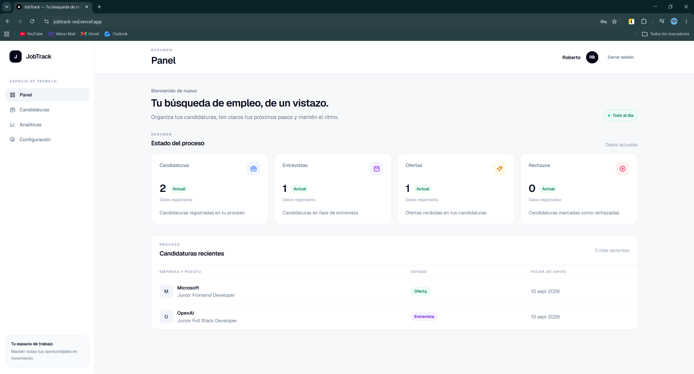
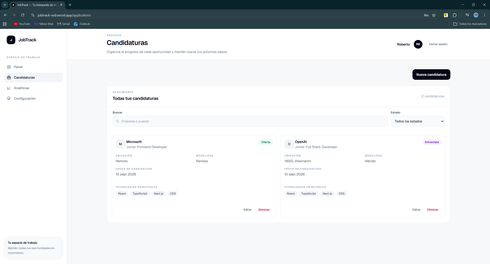
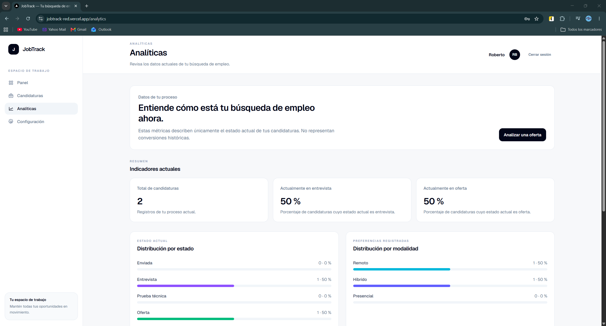
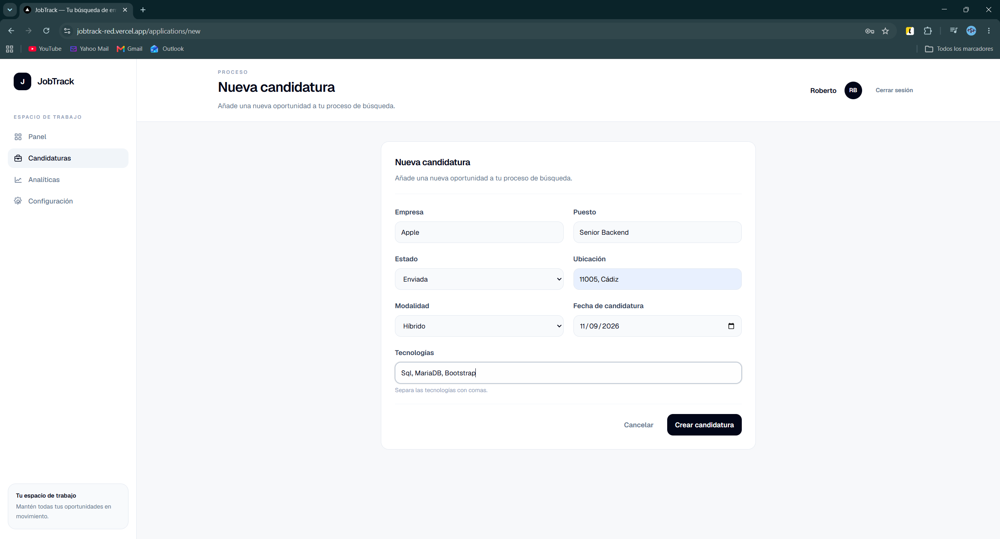
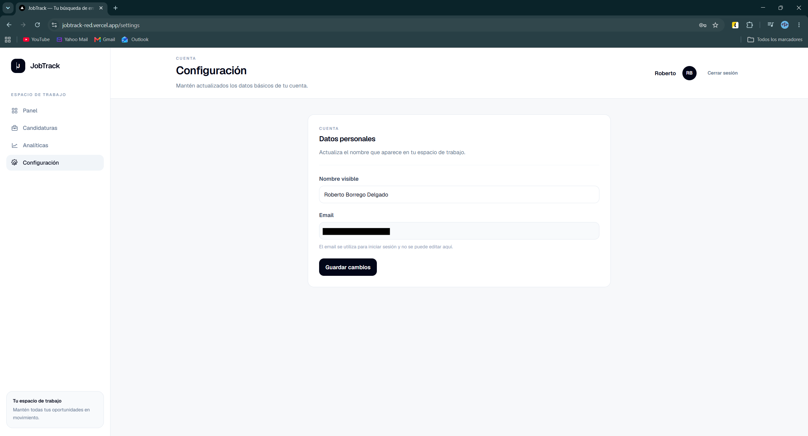

# JobTrack

JobTrack es una aplicación full-stack para gestionar candidaturas de empleo y analizar el progreso de una búsqueda de trabajo desde un único espacio privado.

## Demo

[https://jobtrack-red.vercel.app](https://jobtrack-red.vercel.app)

## Capturas

Las capturas del proyecto se encuentran en `docs/images/`.

### Dashboard



### Candidaturas



### Analíticas



### Nueva candidatura



### Configuración



## Funcionalidades

- Registro, inicio de sesión y cierre de sesión.
- Sesiones persistentes mediante Better Auth.
- Candidaturas privadas y aisladas por usuario.
- Crear, editar y eliminar candidaturas.
- Búsqueda por empresa o puesto y filtros por estado.
- Dashboard con resumen de la búsqueda.
- Estadísticas y analíticas del estado actual.
- Distribución por estado y por modalidad de trabajo.
- Tecnologías más frecuentes.
- Evolución mensual basada en la fecha de candidatura.
- Configuración de cuenta para editar el nombre visible.
- Análisis automático local de ofertas de empleo.
- Proveedor OpenAI opcional.
- Interfaz responsive y accesible.
- Tests unitarios, de componentes, de Server Actions y E2E.
- Imagen Docker multi-stage.
- Integración continua con GitHub Actions.

## Stack tecnológico

### Frontend

- Next.js 16 con App Router
- React
- TypeScript
- Tailwind CSS

### Backend

- Next.js Server Components
- Server Actions
- Better Auth

### Base de datos

- PostgreSQL
- Prisma
- Neon

### Testing

- Vitest
- React Testing Library
- Playwright

### DevOps

- Docker
- GitHub Actions
- Vercel

### Análisis de ofertas

- Analizador local determinista basado en reglas.
- Soporte opcional para OpenAI.

## Arquitectura

El flujo principal de datos es intencionadamente sencillo:

```text
Browser
  → Next.js
  → Server Components / Server Actions
  → Prisma
  → PostgreSQL / Neon
```

La autenticación y autorización siguen este flujo:

```text
Usuario
  → Better Auth
  → sesión
  → autorización por userId
  → candidaturas privadas
```

Las páginas protegidas obtienen la sesión en el servidor. Las operaciones de lectura y escritura filtran las candidaturas por el usuario autenticado antes de acceder a los datos.

## Seguridad

- El `userId` no se acepta desde el navegador para decidir el propietario de una operación.
- La autorización se realiza en el servidor a partir de la sesión autenticada.
- Las candidaturas se consultan y modifican filtradas por usuario.
- Los archivos `.env` están ignorados por Git; el repositorio solo incluye ejemplos con placeholders.
- Los secretos permanecen fuera del repositorio.
- `OPENAI_API_KEY` solo se utiliza en código de servidor.
- Los tests y la CI no realizan llamadas reales a OpenAI.
- El análisis local procesa la oferta dentro de JobTrack y no envía el texto a servicios externos.

## Analizador de ofertas

El proveedor predeterminado es local y gratuito. No es un sistema de IA generativa: utiliza reglas deterministas para extraer información de una oferta.

Puede detectar:

- Tecnologías.
- Seniority cuando existe evidencia suficiente.
- Modalidad de trabajo.
- Keywords.
- Un resumen determinista.
- Highlights orientados a preparar una candidatura.

Cuando el seniority o la modalidad son ambiguos, el resultado usa `unknown`. El analizador no inventa experiencia del usuario ni calcula porcentajes de compatibilidad.

OpenAI queda como proveedor opcional y solo se utiliza cuando `JOBTRACK_AI_PROVIDER=openai` y existe una API key válida.

## Testing

La suite verificada en el repositorio incluye:

- 76 tests con Vitest.
- 12 flujos E2E funcionales con Playwright.
- 1 comprobación E2E adicional de responsive.
- 89 tests automatizados en total.

Los tests cubren:

- Validación de formularios y reglas de negocio.
- Componentes React.
- Server Actions.
- Registro, login, logout y rutas protegidas.
- Autorización y aislamiento entre usuarios.
- CRUD de candidaturas.
- Analíticas.
- Análisis local de ofertas y selección de proveedor.
- Ausencia de API key de OpenAI.
- Flujo E2E de la aplicación.

## CI/CD

GitHub Actions ejecuta en la pipeline de calidad:

1. `npm ci`.
2. Lint.
3. Tests de Vitest.
4. Build de Next.js.
5. Migraciones de la base de datos de test.
6. Tests E2E con Playwright.
7. Build de la imagen Docker.

La imagen Docker se valida en CI, pero no se publica automáticamente desde GitHub Actions.

## Docker

El `Dockerfile` utiliza tres etapas:

- `deps`: instala las dependencias con `npm ci`.
- `builder`: genera Prisma y compila la aplicación.
- `runner`: ejecuta la imagen final con los artefactos mínimos necesarios.

El proceso final se ejecuta con un usuario no root. El build Docker activa `JOBTRACK_STANDALONE_BUILD=true` para generar la salida standalone. Los builds normales, incluido Vercel, no activan standalone.

## Instalación local

Requisitos: Node.js, npm y una instancia PostgreSQL accesible.

```bash
git clone https://github.com/rbordel2102/jobtrack.git
cd jobtrack
npm install
cp .env.example .env
```

Configura las variables de entorno del archivo `.env` con tus propios valores y después ejecuta:

```bash
npm run db:generate
npm run db:migrate
npm run dev
```

La aplicación estará disponible en [http://localhost:3000](http://localhost:3000).

## Variables de entorno

| Variable | Descripción |
| --- | --- |
| `DATABASE_URL` | URL de conexión PostgreSQL agrupada para la aplicación. |
| `DIRECT_URL` | URL directa utilizada por Prisma para migraciones. |
| `BETTER_AUTH_SECRET` | Secreto privado para Better Auth. |
| `BETTER_AUTH_URL` | URL base de la aplicación. |
| `JOBTRACK_AI_PROVIDER` | Proveedor de análisis: `local` por defecto u `openai`. |
| `OPENAI_API_KEY` | API key opcional; solo necesaria con el proveedor OpenAI. |
| `OPENAI_MODEL` | Modelo opcional para el proveedor OpenAI. |

Configuración recomendada por defecto:

```env
JOBTRACK_AI_PROVIDER=local
```

No pongas credenciales reales en `.env.example` ni en el repositorio.

## Scripts

| Comando | Uso |
| --- | --- |
| `npm run dev` | Inicia el servidor de desarrollo. |
| `npm run build` | Genera el build de producción. |
| `npm run lint` | Ejecuta ESLint. |
| `npm test` | Ejecuta los tests de Vitest. |
| `npm run test:e2e` | Ejecuta los tests E2E con Playwright. |
| `npm run db:generate` | Genera el cliente de Prisma. |
| `npm run db:migrate` | Aplica migraciones en desarrollo. |
| `npm run test:db:migrate` | Aplica migraciones en la base de datos de test. |

## Estructura del proyecto

```text
app/          # Rutas, páginas y Server Actions
components/   # Componentes reutilizables de interfaz
lib/          # Lógica de negocio y servicios
prisma/       # Schema y migraciones
tests/        # Tests unitarios, de componentes, integración y E2E
types/        # Tipos compartidos
docs/         # Capturas y documentación visual
.github/      # Workflows de GitHub Actions
```

## Decisiones técnicas

- Server Components por defecto para mantener la lógica cerca del servidor.
- Client Components solo donde hace falta interacción, como formularios y búsqueda.
- Server Actions para mutaciones con validación server-side.
- PostgreSQL para persistencia de datos relacionales.
- Prisma para acceso tipado a la base de datos.
- Better Auth para registro, login y sesiones.
- Analizador local para no depender de APIs de pago en el uso predeterminado.
- Base de datos separada para tests E2E.
- Build Docker separado del build normal de Vercel: Docker activa standalone de forma explícita.

## Limitaciones

- No hay recuperación de contraseña.
- No hay login social.
- No hay historial de cambios de estado.
- El rate limiting no es distribuido.
- OpenAI es opcional y requiere configuración externa.
- El analizador local está basado en reglas y no es generativo.
- No hay sistema de notificaciones.

## Roadmap

- Historial de estados.
- Recuperación de contraseña.
- Login social.
- Notificaciones.
- Mejoras de analítica.

## Autor

**Roberto Borrego Delgado**

- GitHub: [repositorio de JobTrack](https://github.com/rbordel2102/jobtrack)
- LinkedIn: [Roberto Borrego Delgado](https://www.linkedin.com/in/roberto-borrego-delgado-1b410a315/)
